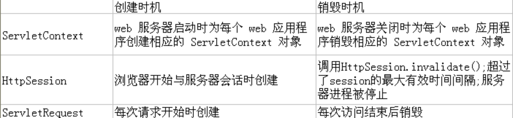

# 监听器

### 1.什么是监听器？

监听器就是一个实现特定接口的普通java类，该类的对象专门用于监听另一个java对象的方法调用或属性改变，当被监听对象发生上述事件后，
监听器某个方法将立即被执行，作为开发者我们需要根据需求在方法中编写业务编码来实现我们想要的效果。

根据监听的事件类型，监听器主要有以下几种：

  1.1、监听域对象自身的创建和销毁的事件监听器
   
    ServletContextListener
    HttpSessionListener
    ServletRequestListener
      
  它们分别用于监听 ServletContext、HttpSession 和 ServletRequest 这三个域对象的创建和销毁。

  创建、销毁时机如下图所示：

  
      
  1.2、监听域对象中的属性的增加和删除的事件监听器

    ServletContextAttributeListener
    HttpSessionAttributeListener 
    ServletRequestAttributeListener 

  它们分别用来监听 ServletContext、HttpSession、HttpServletRequest 这三个对象中的属性信息的变更。
  
这三个接口中都定义了三个方法来处理被监听对象中的属性的增加、删除和替换的事件，同一个事件在这三个接口中对应的方法名称完全相同，
  只是接收的参数类型不同

  1.3、监听绑定到 HttpSession 域中的某个对象的状态的事件监听器
  
    HttpSessionBindingListener
    HttpSessionActivationListener

  这是两个特殊的监听器接口，用来帮助 JavaBean 对象了解自己在 Session 域中的状态，实现这两个接口的类不需要 web.xml 文件中进行注册。

### 2.它有什么用？举例说明

它们的作用根据它们各自的特点来决定的：

- **统计网站在线人数**，这个应该是用 HttpSessionListener 实现的，监听浏览器用户会话信息，并统计用户会话数量。
- **数据初始化**，ServletContext 对象在服务器启动的时候创建，服务器停止的时候销毁，所以常用于做一些数据初始化操作。

### 3.有没有更好的可代替它的相关技术？