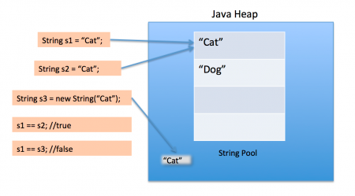
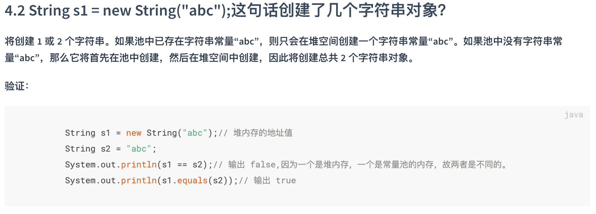

# String类

### 1.String类的使用及内存原理

- 1.1 **String实例化的两种方式**：

    - 方式1：直接赋值：
      
        ```java
        String str1 = "Hello,World";
        ```

    -  方式2：通过new关键字，调用构造函数实例化：

        ```java
        String str1 = new String("Hello,World");
        ```

- 1.2 **内存原理**：

    直接赋值和通过构造函数（即通过new关键字）实例化 `String` 对象的主要区别在于存储的区域不同，直接赋值存储在字符串常量池中，而通过构造函数实例化存储在堆内存中。
  
    如下图所示：

  
  
  正因为这个差异，所以存储在字符串常量池中的 `String` 对象和存储在堆内存中的 `String` 对象是两个内存   地址不同的两个对象。

  所以，当我们分别使用 `==` 号和 `equals()` 方法比较 `str1` 和 `str2` 的时候会得到如下结果：

    ```java
    System.out.println(str1 == str2); //false
    System.out.println(str1.equals(str2)); //true
    ```

    因为 `==` 号对基本数据类型比较的是数据值，对引用数据类型比较的是引用的内存地址，`equals()` 方法比较的则是两个对象的数据值，而 `String` 是引用数据类型。

  
   备注：关于 String 类和字符串常量池相关知识，还可参考该链接文档：[4.1 String 类和常量池](https://snailclimb.gitee.io/javaguide/#/docs/java/jvm/Java内存区域?id=_41-string-类和常量池)

### 2.String类的三大特性：

- **不变性**：是⼀个 immutable 模式的对象，不变模式的主要作⽤是当⼀个对象需要被多线程共享并

  频繁访问时，可以保证数据的⼀致性。

- **常量池优化**：以上两种方式创建 `String` 对象之后，会在字符串常量池中进⾏缓存，下次创建**同样**的对象时，会直接返回缓存的引⽤，而不是重新创建一个对象。但需要注意的是，使用 `new` 关键词创建对象有所不同，如下图所示（这也是个面试题）：


  


- **final关键词修饰**：String 类不可被继承，提⾼了系统的安全性。


### 3.常见面试题：

